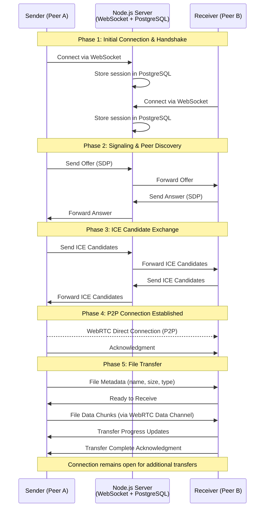

# File Sharing over WebRTC

A peer-to-peer (P2P) file-sharing application that enables users to transfer files up to 3 GB between remote devices without direct network connection.

## 🚀 Overview

This application leverages WebRTC technology to create secure, direct connections between peers for efficient file sharing over the internet. By utilizing peer-to-peer architecture, files are transferred directly between users without the need for intermediate server storage, ensuring privacy and faster transfer speeds.

## 🛠️ Technology Stack

- **Frontend**: ReactJS
- **Backend**: Node.js
- **Database**: PostgreSQL
- **Real-time Communication**: WebRTC
- **Connection Protocol**: WebSocket

## ✨ Key Features

- **Peer-to-Peer File Transfer**: Direct file sharing between users without intermediate server storage
- **Large File Support**: Transfer files up to 3 GB in size
- **Secure Data Transfer**: Utilizes WebRTC for secure data sharing over the internet
- **Remote Device Connectivity**: Share files between devices without direct network connection
- **WebSocket Handshake**: Implements WebSocket for initial connection handshake and acknowledgment, ensuring reliable connection setup
- **No Upload Limits**: Files are shared directly between peers, bypassing traditional upload/download bottlenecks

## 🔧 How It Works

1. **Initial Handshake**: WebSocket establishes the initial connection between peers and facilitates the exchange of connection metadata
2. **WebRTC Connection**: Once peers are connected via WebSocket, WebRTC takes over to establish a direct peer-to-peer connection
3. **File Transfer**: Files are transferred directly between peers through the secure WebRTC data channel
4. **Acknowledgment**: WebSocket ensures reliable acknowledgment of connection status and transfer initiation

### Connection Flow Diagram



## 🏗️ Architecture

The application uses a hybrid architecture:
- **WebSocket**: Handles signaling and initial peer discovery
- **WebRTC Data Channels**: Manages the actual file transfer between peers
- **Node.js Server**: Coordinates peer connections and maintains session state
- **PostgreSQL Database**: Stores user data and connection metadata
- **React Frontend**: Provides an intuitive user interface for file selection and transfer management

## 📦 Getting Started

### Prerequisites
- Node.js (v14 or higher)
- PostgreSQL
- Modern web browser with WebRTC support

### Installation

```bash
# Clone the repository
git clone https://github.com/enoughio/File-share-.git
cd File-share-

# Install dependencies
npm install

# Configure database
# Update database connection settings in your configuration file

# Start the application
npm start
```

## 🤝 Contributing

Contributions are welcome! Please feel free to submit a Pull Request.

## 📄 License

This project is open source and available under the [MIT License](LICENSE).

## 🙏 Acknowledgments

Built with modern web technologies to enable fast, secure, and efficient file sharing across the internet.
